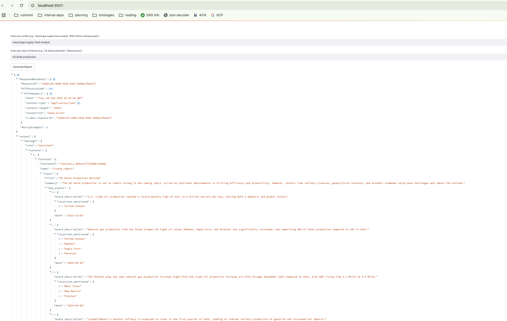
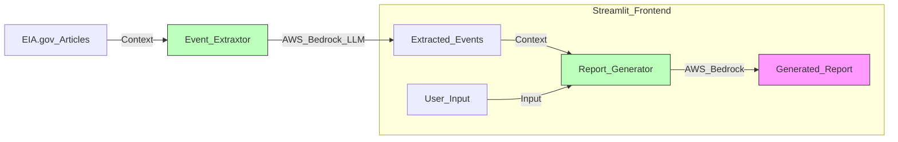

# Wood Mackenzie Generative-AI Challenge: The EIA Event Tracker

The EIA Event Tracker generates a detailed summary and analysis of key events in the energy and mining markets as they are reported on the EIA.gov's "Today in Energy" column.



The report includes the following sections, all generated by AI:

- Title: A title for the report
- Summary: A brief summary of the events the AI model extracted and determined relevant to the user's interests
- Key Events: A list of the key events extracted, including a description, locations mentioned, and a date. This tool can also be improved to include a citation for the events.
- Key Implications: A statement on how the listed events will impact the topic of interest that the user submitted.

The following is an example of a report generated by this tool:

```json
{
              "title": "Resilience of US Shale Production Amid Market Volatility",
              "summary": "This report analyzes recent events in the US shale production sector and their potential implications. Despite market uncertainties, the US shale industry has demonstrated resilience and adaptability, maintaining high production levels and navigating supply chain challenges. Key highlights include record-breaking natural gas and crude oil output, ongoing midstream infrastructure expansions, and continued operational efficiencies. While some regions experienced temporary disruptions, the overall outlook for US shale production remains positive as the industry leverages technology and innovative practices to meet energy demands.",
              "key_events": [
                {
                  "event_description": "ERCOT recorded an all-time winter high for natural gas-fired electricity generation during a cold snap, reaching 49.4 gigawatts.",
                  "locations_mentioned": [
                    "Texas"
                  ],
                  "date": "2024-01-16"
                },
                {
                  "event_description": "Texas electric power sector set a record for daily natural gas consumption at 8.6 billion cubic feet per day.",
                  "locations_mentioned": [
                    "Texas"
                  ],
                  "date": "2024-01-15"
                },
                {
                  "event_description": "Natural gas-fired generation made up 56% of all generation in ERCOT during a three-day cold snap, compared to the January average of 46%.",
                  "locations_mentioned": [
                    "Texas"
                  ],
                  "date": "2024-01-14"
                },
                {
                  "event_description": "Texas implemented weatherization standards requiring critical natural gas infrastructure to be protected against weather emergencies.",
                  "locations_mentioned": [
                    "Texas"
                  ],
                  "date": "2022-08-01"
                },
                {
                  "event_description": "U.S. crude oil production reached a monthly record of over 13.3 million barrels per day, setting both a domestic and global record.",
                  "locations_mentioned": [
                    "United States"
                  ],
                  "date": "2023-12-01"
                },
                {
                  "event_description": "The Matterhorn Express Pipeline, with 2.5 Bcf/d capacity, is expected to begin service to transport natural gas from Permian Basin to Katy near Houston.",
                  "locations_mentioned": [
                    "Permian Basin",
                    "Katy",
                    "Houston",
                    "Texas"
                  ],
                  "date": "2024-09-01"
                },
                {
                  "event_description": "U.S. natural gas production reached a record high of 125.0 billion cubic feet per day, with the Permian, Appalachia, and Haynesville regions accounting for 59% of total production.",
                  "locations_mentioned": [
                    "United States",
                    "Permian",
                    "Appalachia",
                    "Haynesville"
                  ],
                  "date": "2023-12-31"
                }
              ],
              "key_implications": "The recent events demonstrate the resilience and adaptability of the US shale production industry. Despite market volatility and supply chain challenges, the industry has maintained high production levels, leveraging technology and infrastructure expansions to meet growing energy demands.\n\nKey implications for US shale production include:\n\n- Continued record-breaking natural gas and crude oil output, driven by operational efficiencies and midstream capacity additions\n- Strengthened energy security as the US solidifies its position as a leading global producer and exporter of oil and natural gas\n- Increased reliance on natural gas for power generation, particularly in Texas, underscoring the importance of infrastructure weatherization and resilience\n- Ongoing investments in pipeline infrastructure to transport shale gas and oil to domestic and international markets\n- Potential for further production growth as new pipeline and export projects come online in the Permian, Appalachia, and other key shale basins\n\nOverall, the US shale production industry has demonstrated its ability to adapt and thrive in a dynamic market environment, positioning the country as a global energy powerhouse and ensuring the continued availability of affordable, reliable energy."
            }
          }
```

## How it Works
The application runs as a docker container and is written in Python. It has three components:
1. Frontend
	- Written in streamlit.
	- Utilizes AWS Bedrock to take user input (user profile and topics of interest to customize the report) and AI-extracted event data to generate the report. The event data is used in the user prompt as the context. The system prompt is customized based in the user input.
2. Data
	- Data was scraped from EIA.gov's "Today in Energy" reports using Python
3. Event Tracking
	- Articles scraped from EIA.gov are processed by Anthropic LLMs via AWS Bedrock. Event data is pulled from the articles in the following format, where the `path` value is a unique identifier for an article.

```json
{
  "events": [
    {
      "event_description": "U.S. associated natural gas production increased by 7.9% to average 17.1 billion cubic feet per day in 2023 compared to 2022.",
      "locations_mentioned": [
        "United States"
      ],
      "date": "2023-12-31",
      "citation": "U.S. production of associated-dissolved natural gas, or associated natural gas, increased 7.9% in 2023 compared with 2022, averaging 17.1 billion cubic feet per day (Bcf/d) last year, according to data from Enverus Drillinginfo."
    }
  ],
  "path": "detail.php?id=63704"
}
```
## System Diagram


## How to Run
### Requirements
- Docker (Only tested for Mac M1)
- AWS
    - Model access granted for AWS Bedrock Foundation models
        - Anthropic Claude Sonnet 3.5 model used through instance profile
    - Terraform code is included in the `terraform` directory for creating a model instance profile
    - An AWS user or role with access to `awsBedrock:*` actions
- Setup `.env` file (and `Makefile` depending on AWS authentication method). The file is included with empty values.
    - For simplicity, I used an AWS IAM User via a secret access key. This is generally not recommended. The application uses the standard AWS IAM credential chain. Adjust the `Makefile` and .env file accordingly if using an IAM role or some other IAM access method.
    - You also need a Bedrock model profile ARN that your account has been granted access for.

The application can be run using the following commands from the root folder of this repository:
```sh
# See the .env file include in the repo as an example
source .env
make docker-build
make docker-run
```

The application will launch in your default browser at `http://localhost:8501/`.

## Data Pipeline

The application comes pre-loaded with data in the `app/outputs` directory. This is data that was scraped from EIA.gov's "Today in Energy" reports as described above. The pipeline for generating involves two steps, which are separate ETL services. The two steps are both run using Python 3.12. The first step uses the requirements file in the `etl` directory. The second step uses the requirements file in the `app` directory. I used `virtualenv` to manage these environments, however next steps would be to wrap these in Docker images.

1. `python etl/pull_article_metadata.py && python etl/pull_articles.py` (this will generate the `etl/data/articles.json` file)
2. `python app/src/generate_summaries.py etl/data/articles.json outputs/summaries.json` (this will generated the `outputs/summaries.json` file)

The first step uses the requirements file in the `etl` directory. The second step uses the requirements file in the `app` directory.
Both were run with Python 3.12.

Step 1 scrapes the EIA.gov website for article metadata and then scraped the articles themselves.

Step 2 uses Anthropic's Bedrock to extract events from the articles using AWS boto3. Events are extracted in a strictly defined data model using Pydantic.

